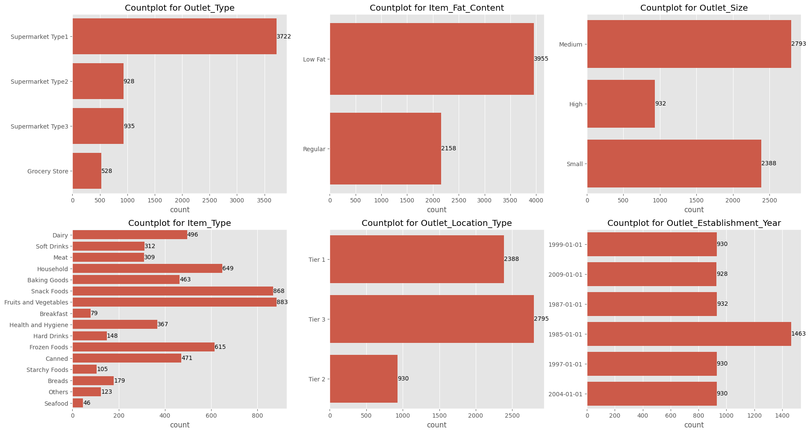
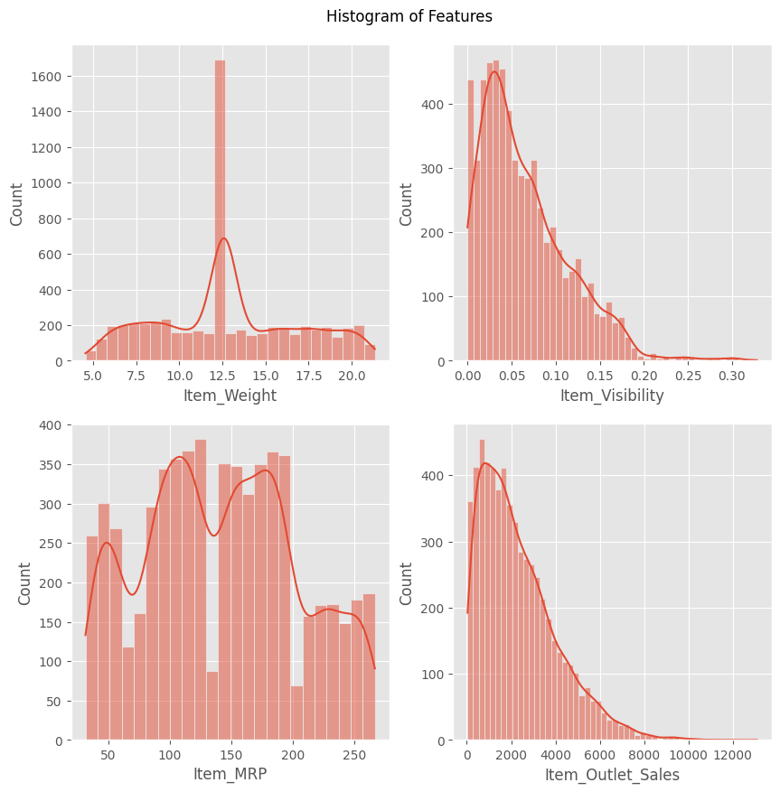
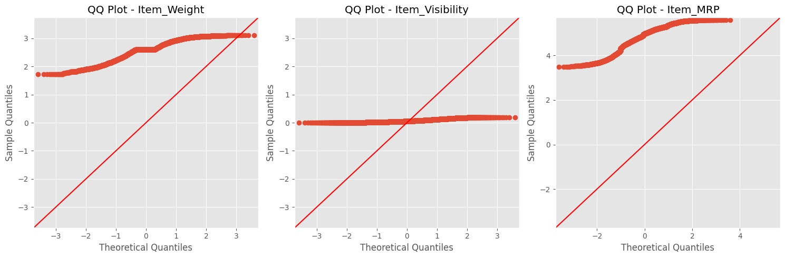
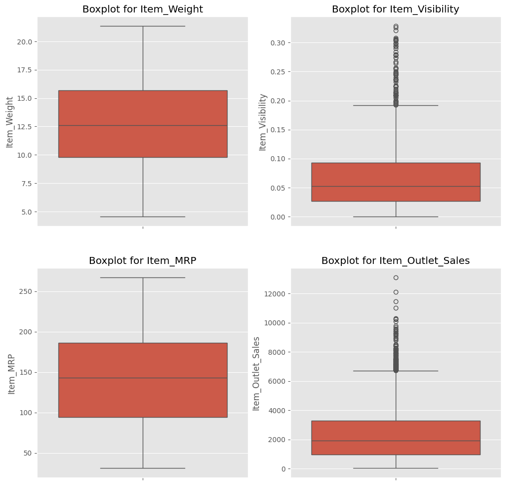
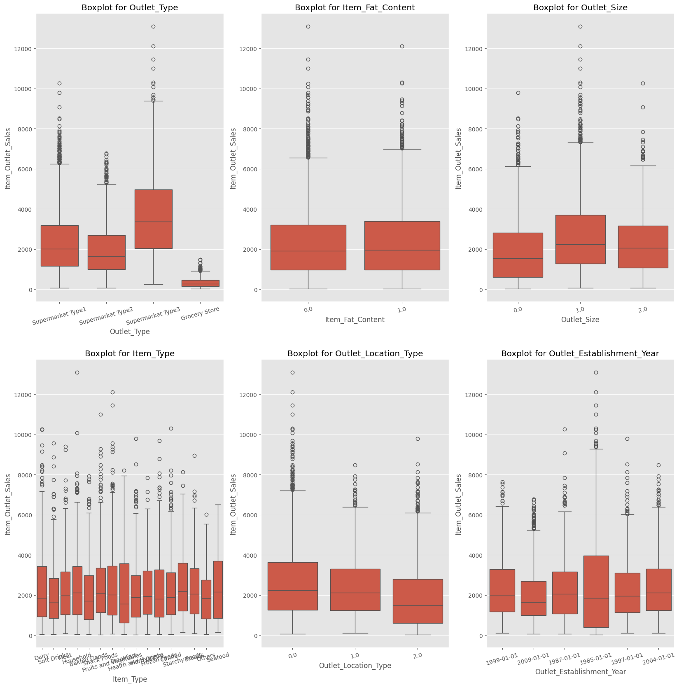

<h1 align="center">Bigmart Sales Prediction</h1>

## Background ❓

BigMart is a leading retail store chain that operates in various cities. The management at BigMart is interested in understanding the sales patterns across different stores and optimizing their inventory and marketing strategies accordingly. To achieve this goal, they have collected historical sales data for a set of products from different stores.

## Problem Statement 🚨

The retail industry, characterized by its dynamic nature and extensive product offerings, faces the challenge of optimizing sales forecasting to maximize revenue and streamline inventory management. BigMart seeks to enhance its sales prediction accuracy through the implementation of advanced machine learning techniques.

## Objective 🎯

The objective of this project is to develop robust regression models capable of accurately forecasting the sales of various products across different BigMart outlets. Leveraging historical sales data spanning multiple outlets and product categories, the aim is to construct predictive models that capture the intricate relationships between key factors influencing sales, such as product visibility, store size, location, product price, and seasonal variations.

## Solution 💡

This is a supervised learning regression problem, where the target variable is the sales figure for each product in each store. We will explore various machine learning techniques to build predictive models, evaluate their performance using appropriate metrics such as Mean Absolute Error (MAE), Mean Squared Error (MSE), Root Mean Squared Error (RMSE), R2 score and Adjusted R2 Score. After examining the metrics we will then select the best-performing model for deployment. The process will start with Exploratory Data Analysis (EDA) with a goal to gain better insight about our data set and eventually develop a model using machine learning methodology.

## 1. Exploratory Data Analysis 💾

I have obtained the data set and now it is time to perform an Exploratory data Analysis (EDA) to gain insight about the dataset and prepare the data for modeling purposes.

**1.1 Dataset**

***“Bigmart Sale”*** data is the historical dataset containing sales data of Bigmart across multiple chains. The dataset contains sales information of outlets established from the year 1985 to the year 2009. 

**1.2 Initial Observation**

- The dataset contains 8523 observation
- The Dataset does not contain 3878 null values and no duplicate values 
- The dataset contains a total of 12 columns out of which we have a single dependent variable labeled “Item_Outlet_Sales”
- The Item_Outlet_Sales feature contains continuous data , which represents the outlet sales of the respective item in the observation identified by the “Item_Identifier” column.

**1.3 Linear Regression Assumption**

A major goal of this project is to check how well suitable the data is to run a linear regression model examining the assumptions of linear regression during the exploratory data analysis phase. The assumptions to check are mentioned below:
1. Linear relationship
2. Multivariate Normality
3. Multicollearity
4. No Heteroscedasticity   

1.4 Univariate, Bivariate and Multivariate Analysis 
---
**1.4.1 Distribution of Features** 

The following diagrams shows the distribution of our features 

**Figure 1.** Countplot of Categorical Features

**Figure 2.** Histogram of Numeric Features

**Figure 3.** QQ Plot of Numeric Features

**1.4.1 Boxplot of Features**

The following diagrams shows the Boxplot of all the features in the dataset:

**Figure 2.** Boxplot of Numeric Features

**Figure 3.** QQ Plot of Numeric Features

